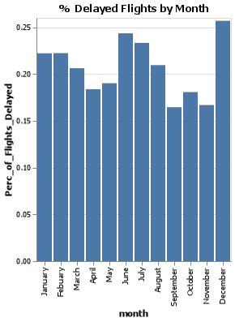
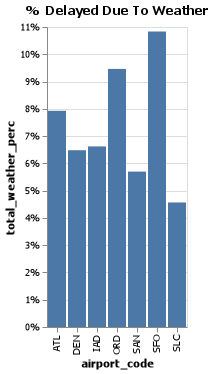

# Project 2: Late Flights and Missing Data

**Samuel M Williams**

## Project Summary

*This project is reviewing data about flights, with a particular focus on delays and dealing with missing data.  Understanding the metrics and dimensions of the data took a little time.  Particularly how the delays due to weather were spread across a few different columns.  Overall, the data was pretty clean and yielded some useful insights.*

## Technical Details

#### Grand Question 1
Which airport has the worst delays? 

San Francisco Airport has the worst delays.  They have the highest percentage of delays at 26%, a full 3% higher than the second highest.
They also have the second highest mean delay in hours at 1.04.  So they have the most delays and the second longest average delays.

If you fly through SFO, make sure you have a little extra time.  The odds of a delay are not in your favor.


| airport_code   |    Total_Flights |   Total_Delayed_Flights |   Total_Mins_Delay |   Perc_of_Flights_Delayed |   Mean_Delay_in_Hours |
|:---------------|-----------------:|------------------------:|-------------------:|--------------------------:|----------------------:|
| ATL            |      4.43005e+06 |                  902443 |        5.39839e+07 |                  0.20371  |              0.996996 |
| DEN            |      2.51397e+06 |                  468519 |        2.51734e+07 |                  0.186366 |              0.895495 |
| IAD            | 851571           |                  168467 |        1.02835e+07 |                  0.197831 |              1.01736  |
| ORD            |      3.59759e+06 |                  830825 |        5.63561e+07 |                  0.230939 |              1.13053  |
| SAN            | 917862           |                  175132 |        8.27625e+06 |                  0.190804 |              0.78762  |
| SFO            |      1.63094e+06 |                  425604 |        2.65505e+07 |                  0.260955 |              1.03972  |
| SLC            |      1.40338e+06 |                  205160 |        1.01234e+07 |                  0.146189 |              0.822396 |

#### Grand Question 2
What is the best month to fly if you want to avoid delays of any length?

Clearly we should be flying in September if we want the minimum chance of a delayed flight, though November isn't too bad either.



#### Grand Question 3

According to the BTS website, the “Weather” category only accounts for severe weather delays. Mild weather delays are not counted in the “Weather” category, but are actually included in both the “NAS” and “Late-Arriving Aircraft” categories. Your job is to create a new column that calculates the total number of flights delayed by weather (both severe and mild). You will need to replace all the missing values in the Late Aircraft variable with the mean. Show your work by printing the first 5 rows of data in a table. Use these three rules for your calculations:

100% of delayed flights in the Weather category are due to weather.
30% of delayed flights in the Late-Arriving category are due to weather.
From April to August, 40% of delayed flights in the NAS category are due to weather. The rest of the months, the proportion rises to 65%.

I learned that assign and aggregate are messy.  Currently my understanding is to use aggregate for summing and assign for other functions, especially ones that refer to values created within the same method chain.  Oh and lambda functions are crazy.  I learned that too.

From the data we see that the majority of the weather delays are due to mild NAS weather reasons.  It makes sense that mild disruptive weather occurs more frequently than severe disruptive weather.


|    | airport_code   | month   |   severe |   mild_late |   mild_nas |   total_weather |
|---:|:---------------|:--------|---------:|------------:|-----------:|----------------:|
|  0 | ATL            | January |      448 |         333 |       2989 |            3770 |
|  1 | DEN            | January |      233 |         278 |        608 |            1119 |
|  2 | IAD            | January |       61 |         317 |        582 |             960 |
|  3 | ORD            | January |      306 |         676 |       3520 |            4502 |
|  4 | SAN            | January |       56 |         204 |        415 |             675 |


#### Grand Question 4

Using the new weather variable calculated above, create a barplot showing the proportion of all flights that are delayed by weather at each airport. Discuss what you learn from this graph.




We can see that SLC has the lowest percentage of delays due to weather and San Francisco has the highest.  This makes sense due to weather being a result of moisture, which is much more available at a coastal location like San Francisco.  Warm temperatures also contribute to inclement weather.  San Francisco is warmer, plus due to its nearness to the ocean it should stay warmer even than places just a little bit further inland.

#### Grand Question 5

Fix all of the varied missing data types in the data to be consistent (all missing values should be displayed as “NaN”). In your report include one record example (one row) from your new data, formatted as a JSON file. You example should have at least one missing value.

Note that I was not able to get all the NA's to behave.  Some of them stubbornly remained nan's instead of NaN's despite my replace statement working for the rest of the missing data.  I guess this is just another mystery that will never be solved.  In my lifetime anyway.

```
{"airport_code":{"2":"IAD"},"airport_name":{"2":null},"month":{"2":"January"},"year":{"2":2005.0},"num_of_flights_total":{"2":12381.0},"num_of_delays_carrier":{"2":"414"},"num_of_delays_late_aircraft":{"2":1058.0},"num_of_delays_nas":{"2":895.0},"num_of_delays_security":{"2":4.0},"num_of_delays_weather":{"2":61.0},"num_of_delays_total":{"2":2430.0},"minutes_delayed_carrier":{"2":null},"minutes_delayed_late_aircraft":{"2":70919.0},"minutes_delayed_nas":{"2":35660.0},"minutes_delayed_security":{"2":208.0},"minutes_delayed_weather":{"2":4497.0},"minutes_delayed_total":{"2":134881.0}}
```

## Appendix A

```python

# Question 1 Code

import pandas as pd
import numpy as np
import altair as alt
import altair_saver
from collections import Counter

url_f = 'https://raw.githubusercontent.com/byuidatascience/data4missing/master/data-raw/flights_missing/flights_missing.json'

flights = pd.read_json(url_f)

flights_2 = flights


flights.groupby('airport_name').minutes_delayed_total.mean()


flights_grouped = flights_2.groupby('airport_code')

flights_q1 = flights_grouped.agg(
  Total_Flights = ('num_of_flights_total', sum),
  Total_Delayed_Flights = ('num_of_delays_total', sum),
  Total_Mins_Delay = ('minutes_delayed_total', sum)).assign(
  Perc_of_Flights_Delayed = lambda x: x.Total_Delayed_Flights / x.Total_Flights,
  Mean_Delay_in_Hours = lambda x: ( x.Total_Mins_Delay/ x.Total_Delayed_Flights)/60  
  )

print(flights_q1.to_markdown())


# Question 2 Code

flights_by_month = flights.query('month != "n/a"').groupby('month').agg(
  Total_Flights = ('num_of_flights_total', sum),
  Total_Delayed_Flights = ('num_of_delays_total', sum)).assign(
  Perc_of_Flights_Delayed = lambda x: x.Total_Delayed_Flights / x.Total_Flights
  ).reset_index()

flights_by_month
months = ["January", "Febuary", "March", "April", "May", "June", "July", "August", "September", "October", "November", "December"]
flights_q2_chart = alt.Chart(flights_by_month, title = "% Delayed Flights by Month").mark_bar().encode(x = alt.X('month', sort = months ), y = 'Perc_of_Flights_Delayed')


flights_q2_chart.save('Flights_Q2_Chart.png')


# Question 3 Code


mean_of_delays_late_aircraft = flights.num_of_delays_late_aircraft.replace(-999, np.nan).mean()
flights_q3 = flights
flights_q3.num_of_delays_late_aircraft = flights.num_of_delays_late_aircraft.replace(-999, mean_of_delays_late_aircraft) 

weather = flights_q3.assign(
    severe = lambda x: x.num_of_delays_weather,
    mild_late = (0.3 * flights_q3.num_of_delays_late_aircraft).round(),
    mild_nas = np.where(flights_q3.month == ("April" or "May" or "June" or "July" or "August"), 0.4 * flights_q3.num_of_delays_nas, 0.65 * flights_q3.num_of_delays_nas).round(),
   total_weather = lambda x: x.severe + x.mild_late + x.mild_nas,
).filter(['airport_code','month','severe','mild_late','mild_nas',
   'total_weather'])

print(weather.head().to_markdown())


# Question 4 Code

weather_2 = weather.groupby("airport_code").agg(
  Total_Weather_Delays = ('total_weather', sum),
  Total_Flights = ('num_of_flights_total', sum)).assign(total_weather_perc = lambda x: x.Total_Weather_Delays/x.Total_Flights).reset_index()


weather_2_chart = alt.Chart(weather_2, title = "% Delayed Due To Weather").mark_bar().encode(x = 'airport_code', y = alt.Y('total_weather_perc', axis=alt.Axis(format='%')))

weather_2_chart.save('Weather_2_Chart.png')


# Question 5 Code


flights_clean = flights.replace([-999, "1500+",'n/a'], np.nan)


```