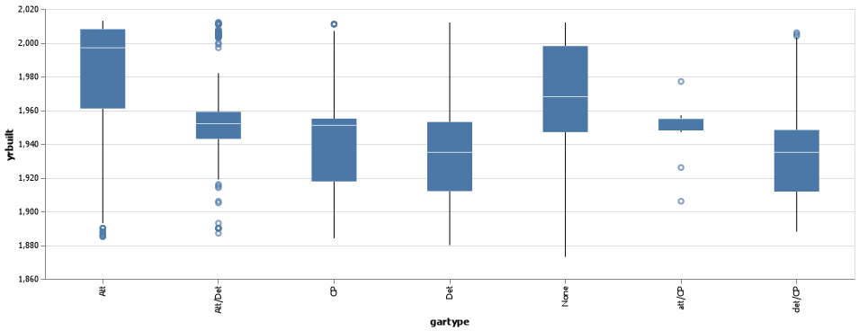
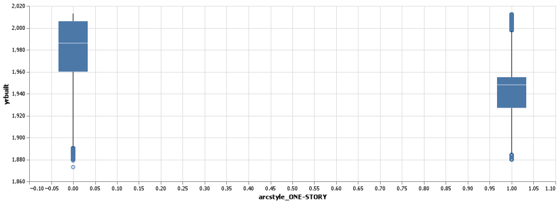
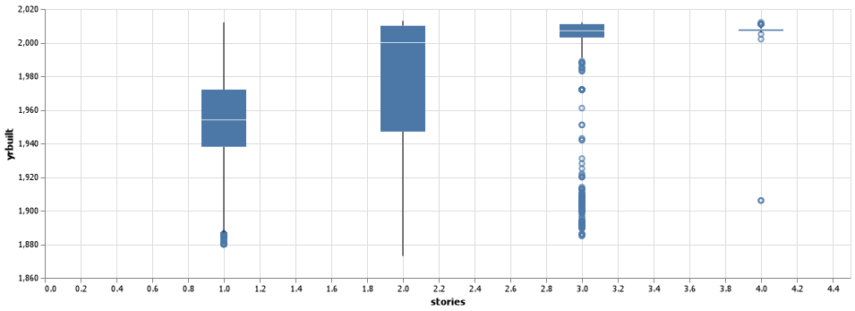
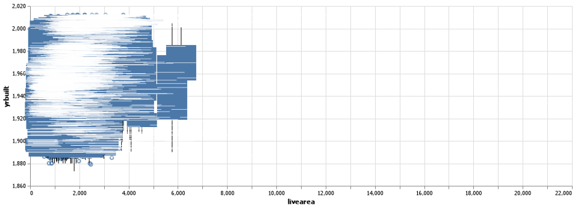

# Project_4.md

__Samuel M Williams__


## Project Summary

This project was an introduction to machine learning.  I learned that choosing features is important, and domain knowledge is important but when you are short on time the kitchen sink method can be surprisingly effective.  I would comment on what features worked best and why, but without domain knowledge I would just be guessing.  And guessing in areas you lack real knowledge or experience is best left to the politicians.

## Technical Details

#### Grand Question 1

I used the kitchen sink method on the analysis and then systematically removed the lowest contributing features until I was left with a manageable number but still had an accuracy of over 90%.  

Then a picked a few of the highest contributors and have graphed them below.

I understand that is backwards of the prescribed method, but it was very effective.  And honesty is the best policy.  :)


Some of the garage types show some good grouping before or after 1980.  Particularly Alt and Det.



Notice there are more homes that aren't one story after 1980, with many single story homes centered around 1940, which every number line reading member of humanity can tell is before 1980.




The more stories it has, the more likely it is to be after 1980.  Good correlation here.

#### Grand Question 2

I used the following features and target to create my model.

```
# features
x = dat_ml.filter(['abstrprd', 'livearea', 'basement', 'stories', 'numbaths',
 'sprice', 'netprice', 'tasp', 'gartype_Att', 'arcstyle_ONE-STORY'])


# target
y = dat_ml['before1980']

```

The relevant settings were.

```
x_train, x_test, y_train, y_test = train_test_split(x, y, test_size = 0.3, random_state = 13)


# create the model
classifier = RandomForestClassifier()
```

As you can see a random forest classifier was used.  I used it because I didn't see much difference in the results from the different classifier models so I just stuck with this one because everyone seemed to like it.  Peer pressure I guess.

Without further ado, I give you... the accuracy!

Accuracy = 0.902

The accuracy was higher with the kitchen sink method, but I trimmed down the lowest contributing features until the accuracy was close to 90%.  That allowed me to keep the number of features as small as possible, but still have an accuracy over 90%.  Less features helps the model be more understandable to humans.

#### Grand Question 3
Living area was the highest contributing feature.
Feast your eyes upon a chart that is mostly gobbledygook.
I am not sure how to make this more readable, but this is the best I could do.



There does appear to be an upward trend with larger living area being newer and smaller living area being older.  But it doesn't look very strong.  This might be worth doing in a x-y plot and putting a best fit line on.  Boxplots are nice, but in some ways they obscure the individual data points.

I have also included the graphs from question one.  Do to the way I reverse engineered this assignment with the kitchen sink method, those q1 graphs are pretty insightful.


Some of the garage types show some good grouping before or after 1980.  Particularly Alt and Det.


Notice there are more homes that aren't one story after 1980, with many single story homes centered around 1940, which every number line reading member of humanity can tell is before 1980.


The more stories it has, the more likely it is to be after 1980.  Good correlation here.

#### Grand Question 4

Here are the numbers.


The Precision (1 or true) is calculated by the true positive predictions divided by all the positive predictions, which equals 0.92.

The Precision (0 or false) is calculated by the true negatives divided by all of the negative predictions, which equals 0.87.


The Recall (of all true values) is calculated by the true positives divided by all that should have been marked true, so the true positives plus the false negatives.
This equals 0.93.

The Recall (of all false values) is calculated by the true negatives divided by all that should have been marked false, so the true negatives and the false positives.  This equals 0.86.

And for the last number for you, the accuracy is calculated by the true predictions (true positives and true negatives) divided by all predictions or all rows in the dataset.  This equals 0.901.

For further information on these data, please direct inquiries to Sam Williams at williamssa@byui.edu


## Appendix A
```
import pandas as pd
import altair as alt
import altair_saver
import numpy as np
from sklearn.model_selection import train_test_split
from sklearn import metrics
from sklearn.tree import DecisionTreeClassifier
from sklearn.naive_bayes import GaussianNB 
from sklearn.ensemble import RandomForestClassifier 
from sklearn.ensemble import GradientBoostingClassifier

url_1 = "https://raw.githubusercontent.com/byuidatascience/data4dwellings/master/data-raw/dwellings_denver/dwellings_denver.csv"
url_2 = "https://raw.githubusercontent.com/byuidatascience/data4dwellings/master/data-raw/dwellings_ml/dwellings_ml.csv"

dat_dwell = pd.read_csv(url_1)


dat_ml = pd.read_csv(url_2)

alt.data_transformers.enable('json')


# question one


gartype_q1_chart = (alt.Chart(dat_dwell)
    .mark_boxplot(
        size = 50
    )
    .encode(
        x = 'gartype',
        y = alt.Y('yrbuilt', scale = alt.Scale(zero=False))
    )
    .properties(
        width = 900
    )
    )

gartype_q1_chart.save('GARTYPE_Q1_Chart.png')


arcstyle_q1_chart = (alt.Chart(dat_ml)
    .mark_boxplot(
        size = 50
    )
    .encode(
        x = 'arcstyle_ONE-STORY',
        y = alt.Y('yrbuilt', scale = alt.Scale(zero=False))
    )
    .properties(
        width = 900
    )
    )

arcstyle_q1_chart.save('ARCSTYLE_Q1_Chart.png')


stories_q1_chart = (alt.Chart(dat_dwell)
    .mark_boxplot(
        size = 50
    )
    .encode(
        x = 'stories',
        y = alt.Y('yrbuilt', scale = alt.Scale(zero=False))
    )
    .properties(
        width = 900
    )
    )

stories_q1_chart.save('stories_Q1_Chart.png')


# question two

# features
x = dat_ml.filter(['abstrprd', 'livearea', 'basement', 'stories', 'numbaths',
 'sprice', 'netprice', 'tasp', 'gartype_Att', 'arcstyle_ONE-STORY'])


# target
y = dat_ml['before1980']


x_train, x_test, y_train, y_test = train_test_split(x, y, test_size = 0.3, random_state = 13)


# create the model
classifier = RandomForestClassifier()

# train the model
classifier.fit(x_train, y_train)

# make predictions
y_predictions = classifier.predict(x_test)

# test how accurate predictions are
metrics.accuracy_score(y_test, y_predictions)


classifier.feature_importances_


# question three

livearea_q3_chart = (alt.Chart(dat_dwell)
    .mark_boxplot(
        size = 50
    )
    .encode(
        x = 'livearea',
        y = alt.Y('yrbuilt', scale = alt.Scale(zero=False))
    )
    .properties(
        width = 900
    )
    )

livearea_q3_chart.save('LIVEAREA_Q3_Chart.png')


# question four

metrics.plot_confusion_matrix(classifier, x_test, y_test)

print(metrics.classification_report(y_test, y_predictions))

# I had to snip an image of the table and the graph because they wouldn't save using the same methods we used before.  So there is no code for creating that image.

```